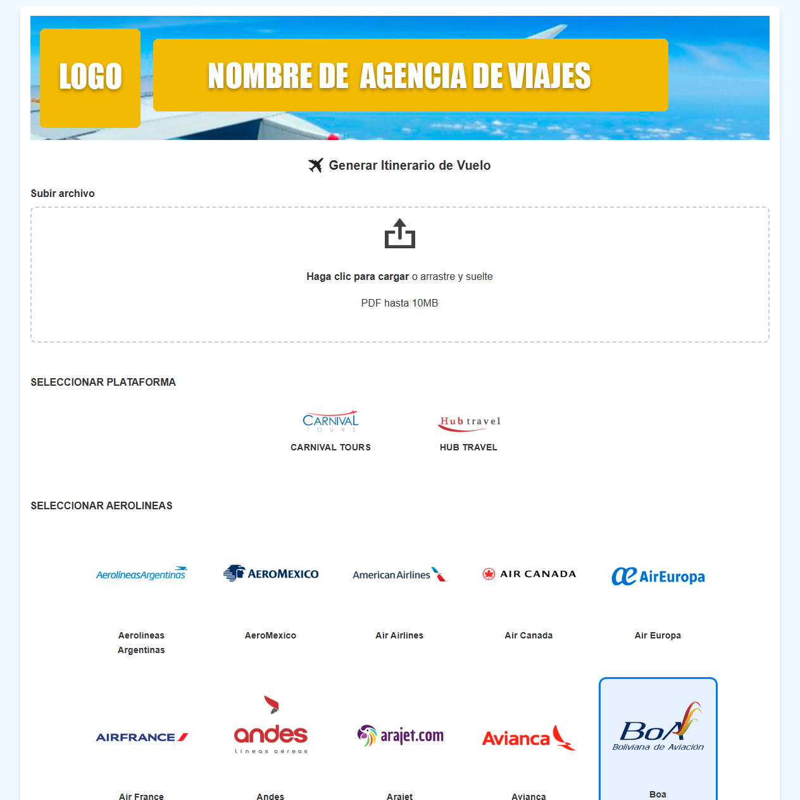
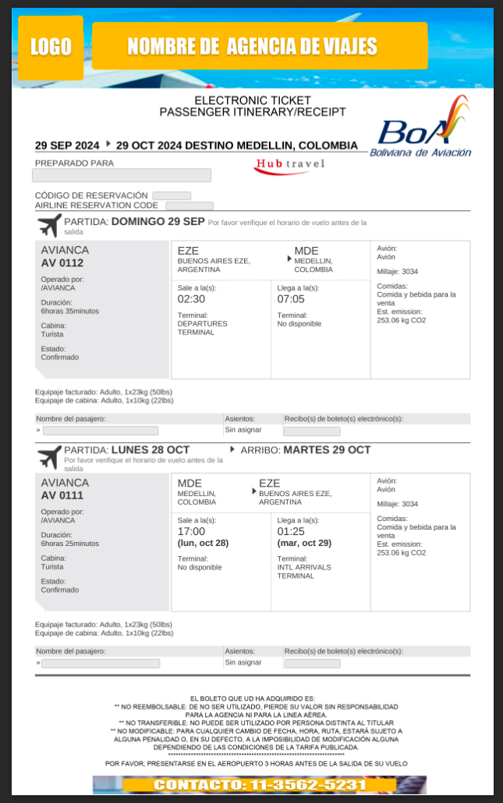

# 🛫 Travel Itinerary Header Generator

Aplicación web que permite generar itinerarios de vuelo en formato PDF de manera profesional y personalizada.  
Ideal para agencias de viaje que necesiten emitir documentos con membretes, logos y textos legales ajustados a cada plataforma.

---

## 🖼️ Capturas de pantalla

### Interfaz principal (selección de plataforma y aerolínea)


### Ejemplo de itinerario generado


---

## 🎯 Funcionalidades principales

- 📤 Carga de un archivo PDF base con información del itinerario
- 🖼️ Selección de aerolínea y plataforma (Agencia, Despegar, Almundo, etc.)
- 🧾 Inserción automática de:
  - Membrete (imagen superior)
  - Logo de aerolínea
  - Texto legal personalizado
  - Imagen de pie de página
- 💻 Interfaz web intuitiva y responsiva
- 📥 Descarga del PDF final generado con la nueva estética

---

## ⚙️ Tecnologías utilizadas

| Capa         | Herramienta / Lenguaje |
|--------------|-------------------------|
| Backend      | Python + Flask          |
| PDF Engine   | ReportLab + PyPDF2      |
| Frontend     | HTML5 + CSS3 + JavaScript |
| Renderizado  | Jinja2 Templates        |

---

## 🧪 Cómo ejecutarlo localmente

1. Clonar este repositorio:

```bash
git clone https://github.com/RealWise15/itinerary-header-generator.git
cd itinerary-header-generator
```
2. Crear entorno virtual e instalar dependencias:

```bash
python -m venv venv
source venv/bin/activate  # en Windows: venv\\Scripts\\activate
pip install -r requirements.txt
```
3. Ejecutar la app
   
```bash
python app.py
```
4. Abrir en el navegador

```arduino
http://localhost:5000
```

---

## 📁 Estructura del proyecto

📦 itinerary-header-generator
├── App.py             # Lógica principal Flask
├── static/
│   ├── logos/             # Imágenes, Logos
├── templates/
│   └── index.html         # Interfaz HTML principal, CSS, JS
├── README.md              # Este archivo
└── requirements.txt       # Dependencias del proyecto
└── Capturas/
    └── Img1.png
    └── Img2.png

---

## 🧩 Posibles mejoras futuras
Gestión de usuarios y almacenamiento de historial

Subida de logos personalizados

Integración con API de aerolíneas o plataformas

Selección de colores y diseño visual de cada plantilla

---

## 👨‍💻 Autor
Miguel Ángel Quisbert Flores
📍 Buenos Aires, Argentina
🔗 LinkedIn | 📧 quisbert.flores.miguel@gmail.com
🛠️ Técnico Informático | Estudiante de Análisis de Sistemas | Full Stack Jr Developer

⚠️ Este proyecto está protegido bajo licencia Creative Commons BY-NC.  
No está permitido su uso comercial ni su redistribución sin autorización del autor.
